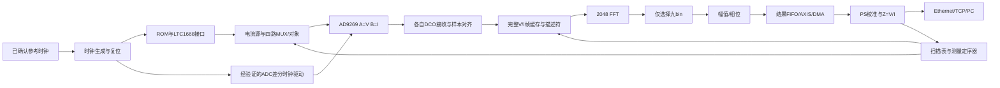

# Phase 0：本板目标系统架构

日期：2026-09-28。本文是后续实现合同，不表示以下模块已经存在。硬件约束以 [hardware_mapping.md](hardware_mapping.md) 为准；未关闭的 NEED_CONFIRMATION 不能用逻辑假设代替。

## 1. 参数与职责

统一配置 `FS_HZ=10240000`、`ROM_LENGTH=FRAME_SAMPLES=FFT_LENGTH=2048`、`TONE_NUM=9`、`TONE_BINS={2,3,7,11,19,37,61,113,199}`；`ELECTRODE_NUM` 在物理映射许可范围内可配，最大32，首版 adjacent 模式至少4。

FS 参数本身不改变时钟。Clocking Wizard 的实际输出、RTL 参数、Python配置、PS元数据必须一致。N先支持二次幂，频点须满足 `0<q<N/2` 且不重复；可选电极必须具有完整映射。ADC/DAC位宽16是本板接口规格，不与电极数量混用。

PL：时基、连续ROM播放、DCO接收、帧缓存、采集定序、FFT、九bin选择、CORDIC、结果缓冲。PS：配置、帧管理、校准、复阻抗、Ethernet/TCP；PC：LUT/reference、可视化与后续成像。Phase2允许原始数据调试上传；生产模式不常态上传2048个FFT结果。



## 2. 时钟与源同步接收

| 时钟域 | 建议责任 | 约束 |
|---|---|---|
| sample clock 10.24MHz | DAC地址/播放、ADC转换、周期epoch | 连续共同源，不能用不均匀clock enable假装均匀采样时钟 |
| DCOA | A输入寄存器与接收FIFO写端 | 默认上升沿；真实输入延迟约束 |
| DCOB | B输入寄存器与接收FIFO写端 | 独立接收，不直接拼异步总线 |
| dsp_clk | 缓存读、FFT、bin、CORDIC | 初步目标100或200MHz；以实现收敛为准 |
| axi_clk | AXI-Lite、DMA/PS接口 | 与dsp不同域时使用规范FIFO/握手 |

时钟方案待 H01/H02。旧ADDA输入50MHz并不证明最终参考可用，更不能假设单级MMCM任意精确产生10.24MHz。Phase1要报告实际分频参数、频率误差、VCO/PFD合法性与jitter；必要时评估合法级联或合适参考源，再决定方案。ADC CLK±在电气驱动确认前不确定 IOSTANDARD。CLK+在B34_L3N，需考虑P/N命名反接。

DAC数据经确定延迟ROM管线，在满足 LTC1668 锁存边沿的时间推出；DACCLK由时钟资源/ODDR转发，setup≥8ns、hold≥4ns，另计PCB偏斜及不确定度。`period_start`必须表示**被DAC实际锁存的样点0**，不是尚未读出ROM的地址0。

双DCO方案：每路I/O寄存器→异步FIFO→样本序号/epoch匹配→V/I对。两FIFO各自出数据就同时读并不能证明同一转换样本。启动必须先验证DCO稳定，再用可重复的共同转换epoch建立每路固定延迟关系；独立两级同步器有一拍不确定性，不能直接充当相位对齐机制。若设计采用单DCO接两总线，须对B总线也做完整板级时序证明，不能凭频率相同选择。

ADC正常模式流水9周期、接收级数和CDC相位共同决定样本对应的转换时刻。使窗口首点对应确定的转换epoch，DCO侧延后提交样本。模拟群延迟由校准处理，不混入数字样本序号。失锁/复位/单路FIFO丢样时使整个当前帧无效并重建epoch；各域异步置复位、同步释放，遵守XPM复位时钟条件。

## 3. 缓存、定序与流水所有权

最少2个完整帧bank，每bank `2048×(16+16)=8192 bytes`，共16KiB，另加两个DCO FIFO、描述符、结果FIFO。该数字不包括FFT内部存储。首版FFT时分复用一核处理V帧、I帧；可比较双核资源/吞吐后升级。

bank状态为 `FREE→CAPTURING→READY→PROCESSING→FREE`，只有完整N对且无错的帧进入READY。帧描述符在开始时锁存，包括 session/scan/measurement/config/map/waveform ID、四电极、N/Fs、起止采样tick、状态。后续配置写不改变正在处理的帧。

建议定序状态：

```text
IDLE -> RESERVE_BANK -> MUX_DISABLE* -> MUX_SET -> MUX_ENABLE*
     -> SETTLE -> WAIT_PERIOD_BOUNDARY -> CAPTURE
     -> FRAME_PUSH -> NEXT_CHANNEL -> RESERVE_BANK
```

`*`仅在 H06 证明真实 EN 可控后实现为物理断开/使能；按当前PDF接地，不能把空状态当作完成此功能。当前phase只保留能力需求，不默认硬件已满足。

- SETTLE从最后有效地址/使能动作算起；窗口开启之前全部转换样本丢弃。
- WINDOW必须连续2048组，不因FFT/TCP反压暂停或跳点，不加窗、不补点后当有效帧。
- 帧入队后尽早启动下一组MUX等待，FFT独立消费READY bank，满足用户要求的并行重叠。
- 在切MUX之前预留bank/描述符/必要结果容量；资源不足在帧间等待。帧内溢出、DCO丢锁或计数不符将整帧标坏，记录原因和缺帧计数。
- `FRAME_PUSH`不能等PS/TCP发完才放行；结果元数据也不能在下一测量覆盖。
- DAC正常扫描连续播放；停止/异常的中心码与模拟关断行为单独定义，不复用旧BIA“每次START再开始播放”的假设。

## 4. 稳定时间与帧率预算

ADG732在+5V测试条件下的切换为数十ns量级，**不等于整个模拟链settling**。本板有100nF电极耦合、放大器、负载和电极接触阻抗。用 `MUX_SWITCH_WAIT_CYCLES=ceil(t_wait*FS_HZ)`；初始台架候选100μs，即1024拍，允许PS调大；它只是保守起点，不是已经证明足够。Phase5通过最坏地址/负载跳变与0.1/0.2/0.5/1/5ms等待对比确定幅相收敛阈值；必要时更长。

本项目固定周期起点会增加0..近200μs等待。忽略细小状态机开销，连续播放且2048点采集占一周期时，相邻采样起点间隔为：

`Tslot = ceil((Tcapture + Tswitch + Tsettle)/Tperiod) × Tperiod`。

只要切换/稳定非零且小于一个周期，通常就是400μs一个测量组合，而非202μs。ADC读出尾部延迟、边界握手、反压还会增加时间，测序应按真正转换时间推导，不能凭FSM拍数估算。

| 模型 | 16电极208组 | 32电极928组 |
|---|---:|---:|
| 仅200μs采样，无其它开销的理论下限 | 41.6ms / 24.04 scan/s | 185.6ms / 5.39 scan/s |
| 本项目约400μs/组稳态预算 | 83.2ms / 12.02 scan/s | 371.2ms / 2.69 scan/s |

尚未计首末帧延迟与PC处理，不能当测得帧率。若将来用户允许任意但可追踪的整数周期起点，可通过相位参考修正提高速度；本版不擅自改变固定边界要求。

一核处理两通道需要4096输入拍，200MHz理想输入时间20.48μs、100MHz为40.96μs，均不等于完整FFT延迟。最终以选定IP架构、输出排序、反压和CORDIC延迟验证能在Tslot内回收bank；不能照搬论文32μs。

## 5. FFT、CORDIC 与单位合同

FFT候选配置：2048点、forward、16-bit signed实输入、虚部0、AXI-Stream、natural-order输出（或可靠使用bin索引）；固定点无缩放优先用于首轮验证，记录实际XCI与工具版本。[AMD PG109](https://www.amd.com/content/dam/xilinx/support/documents/ip_documentation/xfft/v9_1/pg109-xfft.pdf)说明无缩放输出需增长位宽；按16+11+1计划28位分量，实际打包宽度以IP端口为准。

FFT wrapper必须正确发送配置、N个有效拍和TLAST，并处理状态事件；bin计数只在 `valid&&ready` 时推进。不得默认反压时计数仍有效。V/I的channel_id和descriptor贯穿处理，先后输出也必须配对。

bin selector存九组 `Vre,Vim,Ire,Iim`。CORDIC采用矩形到极坐标/向量模式，覆盖四象限、明确phase单位为rad及整数格式、开启或显式补偿内部增益。[AMD PG105](https://docs.amd.com/api/khub/documents/NHMqdvRJIfgF8hdbQmLFuA/content)为配置依据，最终与Vivado2020.2安装版本核对。

设FFT实际输出 `Y=X/2^s`，则 `Apeak_codes=(2/N)·2^s·|Y|`。若block-floating每通道s不同，V/I相除前必须各自恢复尺度。保留原始复数分量用于PS运算，不能只传amp/phase。CORDIC前的归一化/截位也记录尺度，幅值接近零标记phase_invalid。

Python golden必须同时有：浮点DFT真值、16-bit量化输入参考、IP定点模型/明确误差预算。已知相位正弦应输出fft phase=φ-π/2；测试四象限、±π边界、全零、近满幅、DC偏置、多频，以及两通道共同/差分延迟。相位误差用wrap后的差值。

## 6. 扫描映射合同

逻辑接口 `set_electrodes(i_plus,i_minus,v_plus,v_minus)` 接收电极ID，不接收未说明的ADG地址。显示编号可用E1..E，而内部建议0..E-1；协议明确转换。四角色分别查已确认映射。

相邻扫描输出 `(n,n+1,m,m+1) mod E`，要求两对不重合，计数必须为E(E-3)。支持16/32及其它合法数目；不能通过固定32位mask或写死16实现。全扫描标识 `scan_id` 与其中一组采集 `measurement_id` 分开，避免“frame”含义混淆。

## 7. PS、DMA、TCP与校准

PS只在Phase2调试模式接收N组原始V/I；Phase3以后正常结果为每组合九频率。每频率提供频率/bin、V/I复数与幅相、有效性/缩放，再由PS增加Z。

定义模拟转换关系 `Vadc=HV(f)·Vobject`、`Iadc=HI(f)·Rsense·Iobject`，那么 `Z=Rsense·HI/HV·(Vadc/Iadc)`；其中复校准因子包括极性、增益、群延迟和两通道差异。不要混用ADC码、V、A、Ω的单位。

```text
den = Ire²+Iim²
Zre = (Vre·Ire+Vim·Iim)/den
Zim = (Vim·Ire-Vre·Iim)/den
Zamp = hypot(Zre,Zim)
Zphase = atan2(Zim,Zre)
```

第一版PS double/float实现，PL不做浮点除法。电流低于可配置噪声门限、任一通道饱和、丢样或无有效校准时输出明确状态，不能静默输出有效Ω。多电极EIT中的比值是该四端配置的转移阻抗，不自动等同于局部材料阻抗。

结果记录至少包含：协议版本、长度、session/scan/measurement/config/map/calibration ID、四电极、采样率、N、首样时间、九bin、缩放/单位和错误状态。先定义序列化格式再定义C结构，不直接通过TCP发送有padding的struct。

DMA使用PS GP0控制、HP0写DDR；结果FIFO→AXIS→S2MM。原始一帧8192B载荷。PS至少双buffer，先arm DMA再START，完成中断后做cache维护，维护CPU/DMA所有权；TCP慢时停止派发新采集或显式丢整帧计数，不能阻塞DCO采样时钟。TCP有长度前缀、部分读写处理、断线重连、超时和序号检查。具体 lwIP/BSP/GEM/PHY 配置依赖H09。

## 8. 建议模块边界与现有代码迁移

| 目录/模块 | 职责 | 阶段 |
|---|---|---|
| clock/system_clock_gen.sv | 合法时钟配置、锁定及复位 | 1 |
| dac/multisine_rom.sv, dac_player.sv, ltc1668_if.sv | LUT读、周期标签、输出时序 | 1 |
| adc/ad9269_capture.sv | 两DCO输入寄存器与编码；可拆为if/capture | 2 |
| adc/adc_frame_buffer.sv | 双路对齐、完整帧bank、错误处理 | 2 |
| dsp/fft_wrapper.sv, fft_bin_selector.sv | IP握手、双通道处理、九bin | 3 |
| dsp/cordic_wrapper.sv | 数值格式、增益、幅相定义 | 4 |
| mux/adg732_ctrl.sv, electrode_mapper.sv | 按真实接线输出角色地址/可用使能 | 5 |
| control/scan_table.sv, measurement_sequencer.sv | 动态电极数、流水定序 | 5 |
| fifo/result_fifo.sv, axi/axi_control.sv | 描述符、反压、控制/状态 | 分阶段引入 |
| top/mf_eit_top.sv | 真实端口与板级适配 | 随各阶段集成 |

旧BIA的AXI/FIFO、错误元数据和PS复除思路可参考；其八lane解调、单帧等待、播放门控和占位板级约束不能直接成为目标实现。所有新PL模块要求可综合，关键接口有自检查TB；不以行为级实数模型替代可综合模块。
